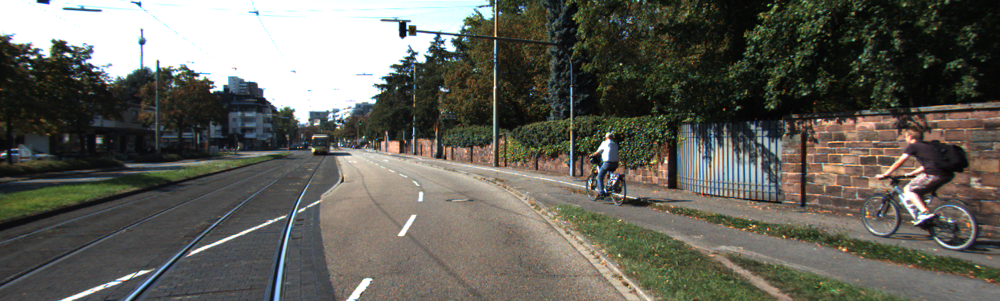
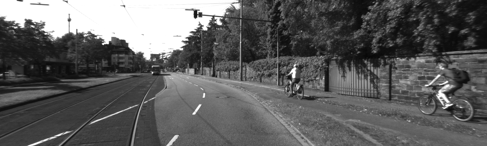
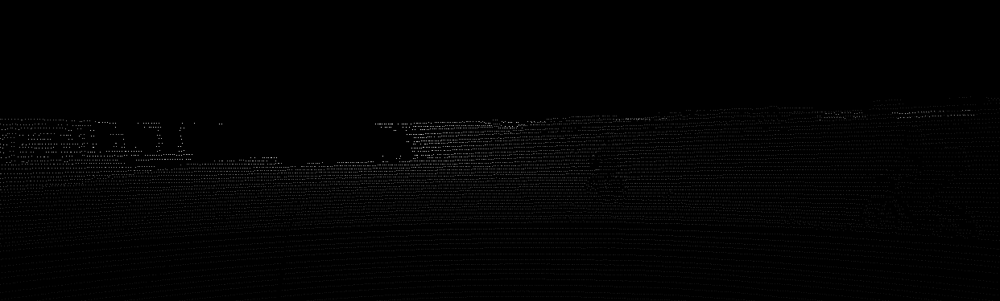
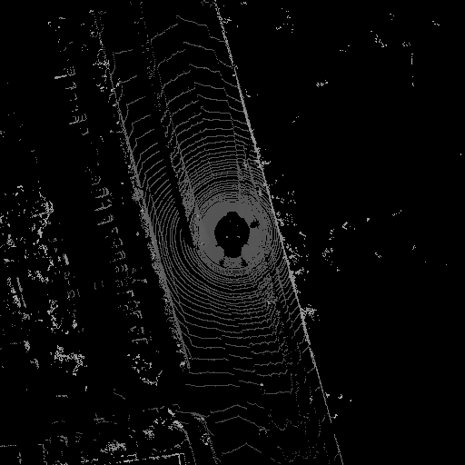

# kitti-raw-pytorch-dataloader
A PyTorch dataloader for the raw sensor data from kitti (https://www.cvlibs.net/datasets/kitti/).

This dataloader is designed to be very easy to get started with and extend. It's built for kitti but can easily be modified for another driving dataset. It has very few requirements listed below.
## Requirements
- python 3.9
- torch
- torchvision
- torchaudio
- opencv-python
- open3d

## Install
1. Clone this repository
2. Install requirements
3. Install with pip: pip install -e .

## Data
The dataset is available at the official Kitti website: (http://www.cvlibs.net/datasets/kitti/raw_data.php). 

You can use this script to download the dataset automatically: (https://s3.eu-central-1.amazonaws.com/avg-kitti/raw_data_downloader.zip).

The data loader expects the data to be structured as follows:
```
├── 2011_09_26
│   ├── 2011_09_26_drive_0001_sync
│   │   ├── image_00
│   │   │   ├── data
│   │   │   │   ├── 0000000000.png
│   │   │   │   ├── 0000000001.png
│   │   │   │   ├── ...
│   │   │   │   └── 0000014540.png
│   │   │   └── timestamps.txt
│   │   ├── oxts
│   │   │   ├── data
│   │   │   │   ├── 0000000000.txt
│   │   │   │   ├── 0000000001.txt
│   │   │   │   ├── ...
│   │   │   │   └── 0000014540.txt
│   │   │   └── timestamps.txt
│   │   ├── velodyne_points
│   │   │   ├── data
│   │   │   │   ├── 0000000000.bin
│   │   │   │   ├── 0000000001.bin
│   │   │   │   ├── ...
│   │   │   │   └── 0000014540.bin
│   │   │   └── timestamps.txt
│   │   ├── calib_cam_to_cam.txt
│   │   ├── calib_imu_to_velo.txt
│   │   ├── calib_velo_to_cam.txt

```
You can then use the example_data\create_split.py to create train, val and test splits with this command:

```bash
python example_data\create_split.py --root .\example_data\kitti_raw --test_split 0.2 --val_split 0.3 --shuffle True
```

## Usage

You can modify the configuration file kitti_raw_data_config.py to included the senors and transforms that you want.

```python
from kitti_raw_dataloader.kitti_raw_dataloaders import get_dataloaders

dataloaders = get_dataloaders()
train_loader = dataloaders["train"]
val_loader = dataloaders["val"]

for i, batch in enumerate(loader):

    # print all keys and their types and shapes
    for key, value in batch.items():
        print(key, type(value))

    # save pointcloud bev binary image
    image = batch["lidar_bev"][0].cpu().squeeze().numpy() * 255
    image = image.astype(np.uint8)
    cv2.imwrite(f"temp/bev/{str(i).zfill(3)}_image.png", image)

    # save rgb image
    image = batch["image_02"][0].detach().permute(1, 2, 0).cpu().numpy()
    image = (image * stds) + means
    cv2.imwrite(f"temp/image_02/{str(i).zfill(3)}_image.png", image)

    # save depthmap binary image
    depthmap = batch["lidar_depthmap"][0].cpu().squeeze().numpy()
    depthmap = depthmap * 255 / depthmap.max()
    cv2.imwrite(f"temp/depthmap/{str(i).zfill(3)}_image.png", depthmap)
    
    break

```

## Included Data

#### Colour Images

#### Binary Images

#### Point Clouds
TODO: add 3D visualisation for pointcloud here
#### Depthmap from Point Cloud

#### BEV Image from Point Cloud


## Included Augmentations
All data augmentations are included as transforms in the dataloader. They are all configurable within the config file.
- Normalise
    - parameters: {"mean": [123.675, 116.28, 103.53], "std": [58.395, 57.12, 57.375], "to_rgb": False}
- Crop
    - parameters: {"left": 0.0, "top": 0.0, "right": 0.0, "bottom": 0.0}
- Random Crop
    - parameters: {"left": 0.0, "top": 0.0, "right": 0.0, "bottom": 0.0}
- Random Flip
    - parameters: {"flip_prob": 0.5, "flip_lidar_in_cam_frame": True}
- Resize
    - parameters: {"height": 375, "width": 1242, "interpolation": "area"}
